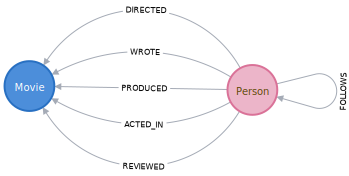

# Neo4j Movies Example Project

This example is using the Movie databases provided by Neo4j as an example project: https://neo4j.com/developer/example-project/  

## Domain Model



This model has 2 nodes and 6 relation types.

### Nodes

- `Movie`
- `Person`

### Relationship types

- `DIRECTED`
- `WROTE`
- `PRODUCED`
- `ACTED_ID`
- `REVIEWED`
- `FOLLOWS`

### Properties

In our model, we have the properties `name` and `born` on `Person` nodes,
`title`, `released` and `tagline` on `Movie` nodes,
and the property `roles` on the `ACTED_IN` relationship.

### GoGM mapping

We can start by defining the properties:

```go
package domain

import "github.com/mindstand/gogm/v2"

type Person struct {
	gogm.BaseNode

	Name     string `gogm:"name=name"`
	BornYear int    `gogm:"name=born"`
}

type Movie struct {
	gogm.BaseNode

	Title        string `gogm:"name=title"`
	ReleasedYear int    `gogm:"name=released"`
	TagLine      string `gogm:"name=tagline"`
}

type ActedIn struct {
	gogm.BaseNode

	Person *Person
	Movie  *Movie
	Roles  []string `gogm:"name=roles;properties"`
}
```

It's interesting to note that we don't have to define all the relationship types if they don't hold any property.

Then, we need to add the relationships between nodes:

```go
package domain

import "github.com/mindstand/gogm/v2"

type Movie struct {
	gogm.BaseNode

	Title        string     `gogm:"name=title"`
	ReleasedYear int        `gogm:"name=released"`
	TagLine      string     `gogm:"name=tagline"`
	Actors       []*ActedIn `gogm:"direction=incoming;relationship=ACTED_IN"`
	Directors    []*Person  `gogm:"direction=incoming;relationship=DIRECTED"`
	Producers    []*Person  `gogm:"direction=incoming;relationship=PRODUCED"`
	Followers    []*Person  `gogm:"direction=incoming;relationship=FOLLOWS"`
	Writers      []*Person  `gogm:"direction=incoming;relationship=WROTE"`
	Reviewers    []*Person  `gogm:"direction=incoming;relationship=REVIEWED"`
}


type Person struct {
gogm.BaseNode

	Name     string     `gogm:"name=name"`
	BornYear int        `gogm:"name=born"`
	Directed []*Movie   `gogm:"direction=outgoing;relationship=DIRECTED"`
	Produced []*Movie   `gogm:"direction=outgoing;relationship=PRODUCED"`
	Follows  []*Person  `gogm:"direction=outgoing;relationship=FOLLOWS"`
	Wrote    []*Movie   `gogm:"direction=outgoing;relationship=WROTE"`
	Reviewed []*Movie   `gogm:"direction=outgoing;relationship=REVIEWED"`
	ActedIn  []*ActedIn `gogm:"direction=outgoing;relationship=ACTED_IN"`
}

type ActedIn struct {
gogm.BaseNode

	Person *Person
	Movie  *Movie
	Roles  []string `gogm:"name=roles;properties"`
}
```

As you can see, relationships are bi-directional, and we need to define the direction (either `outgoing` or `incoming`).

A complete example can be found at: `domain/model.go`

## Usage

